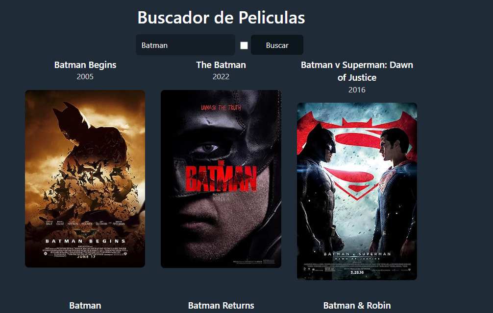

# Api de Buscador de Películas con React

Este proyecto es una aplicación para buscar peliculas desde una interfaz hecha con React. 

## Contenidos

- [Requerimientos](#requerimientos)
- [Requisitos](#requisitos)
- [Instalación](#instalación)
- [Despliegue Local](#despliegue-local)
- [Conseguir una API Key](#conseguir-una-api-key)
- [Capturas de Pantalla](#capturas-de-pantalla)

## Requerimientos

✅ Necesita mostrar un input para buscar la película y un botón para buscar.

✅ Lista las películas y muestra el título, año y poster.

✅ Que el formulario funcione

✅ Haz que las películas se muestren en un grid responsive.

✅ Hacer el fetching de datos a la API

Primera iteración:

✅ Evitar que se haga la misma búsqueda dos veces seguidas.

✅ Haz que la búsqueda se haga automáticamente al escribir.

✅ Evita que se haga la búsqueda continuamente al escribir (debounce)

## Requisitos

Para ejecutar este proyecto, necesitas tener instalado:

- Node.js (versión 14 o superior)
- npm (versión 6 o superior) o yarn (opcional)

## Instalación

1. Clona el repositorio en tu máquina local:

    ```bash
    git clone https://github.com/pauldev24/Search-Movies.git
    cd Search-Movies
    ```

2. Instala las dependencias del proyecto:

    Con npm:
    ```bash
    npm install
    ```

    Con yarn:
    ```bash
    yarn install
    ```

## Despliegue Local

Para ejecutar el proyecto en tu entorno local, utiliza el siguiente comando:

Con npm:
```bash
npm run dev
```

## Conseguir una API Key

Para llamar a la api de películas:
- Ve a Enlace de la API [https://www.omdbapi.com/].
- Regístrate o inicia sesión en tu cuenta.
- Sigue las instrucciones para generar una nueva API Key.
- Copia tu API Key y pégala en el archivo .env en la raíz del proyecto de la siguiente manera

```bash
VITE_API_KEY=tu-api-key
```
## Capturas de Pantalla
